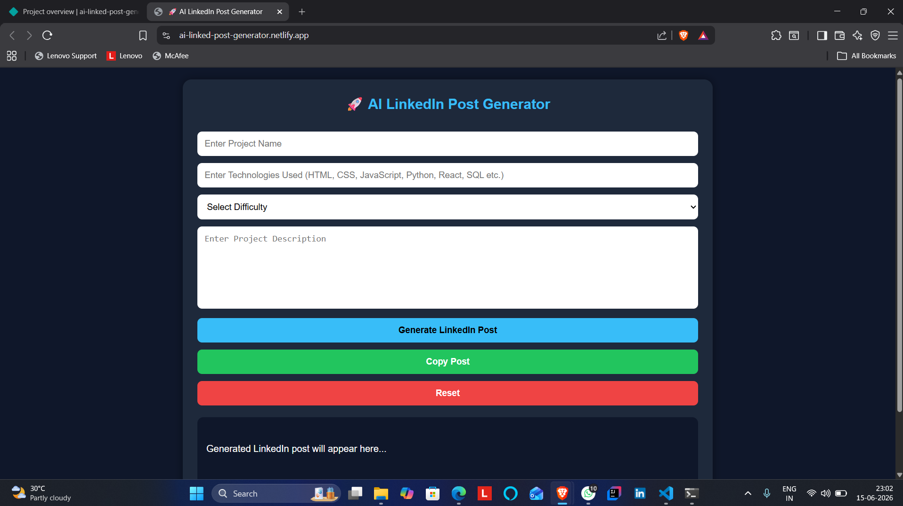
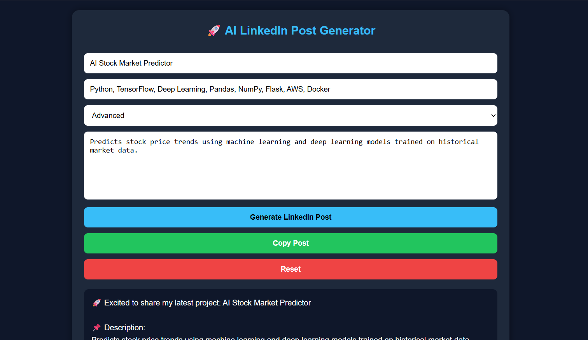
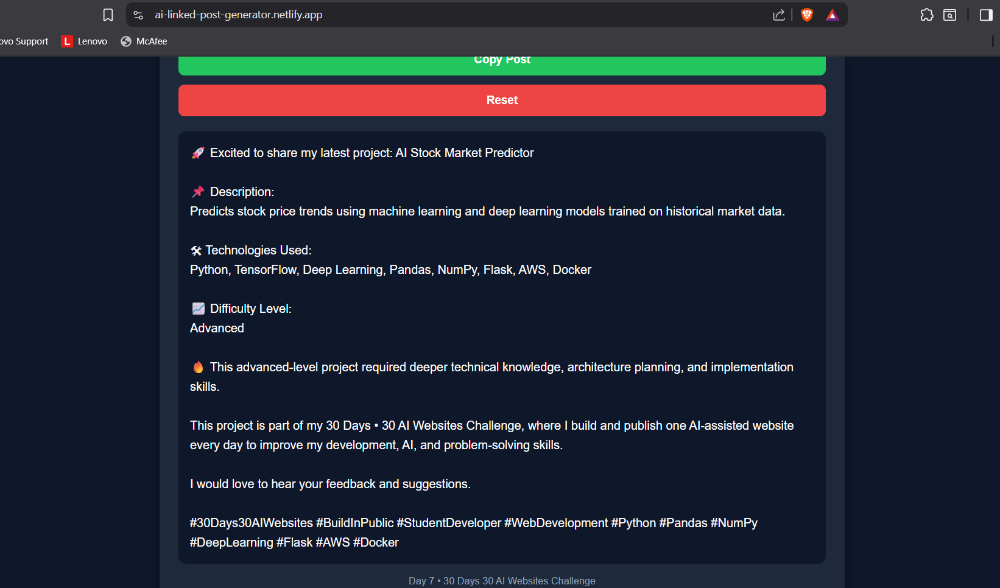

# AI LinkedIn Post Generator

🚀 Day 7 of my 30 Days 30 AI Websites Challenge

AI LinkedIn Post Generator is a web application that helps developers, students, and creators generate professional LinkedIn posts for their projects instantly.

---

## 🌐 Live Demo

Demo Link:

https://ai-linked-post-generator.netlify.app/

## 📸 Screenshots

---

## ✨ Features

✅ Professional LinkedIn Post Generation

✅ Smart Technology-Based Hashtags

✅ Difficulty-Level Based Content

✅ Copy to Clipboard

✅ Responsive UI

✅ AI-Assisted Development

---

## 🛠 Technologies Used

* HTML
* CSS
* JavaScript

---

## 📋 How It Works

1. Enter Project Name
2. Enter Technologies Used
3. Select Difficulty Level
4. Enter Project Description
5. Click Generate LinkedIn Post
6. Copy and Share on LinkedIn

---

## 🚀 Example

### Input

Project Name:
AI Resume Analyzer

Technologies:
HTML, CSS, JavaScript, Python, SQL

Difficulty:
Intermediate

Description:
Analyzes resumes, calculates ATS scores, detects skills, and provides improvement suggestions.

### Output

Professional LinkedIn Post with:

* Project Summary
* Technology Stack
* Difficulty-Based Description
* Relevant Hashtags

---

## 🎯 Challenge Progress

Day 1 ✅ AI Resume Analyzer

Day 2 ✅ AI Career Roadmap Generator

Day 3 ✅ AI Project Idea Generator

Day 4 ✅ AI Skill Gap Analyzer

Day 5 ✅ AI Interview Question Generator

Day 6 ✅ AI Portfolio Review Analyzer

Day 7 ✅ AI LinkedIn Post Generator

---

## 👨‍💻 Author

Anand,

B.Tech CSE(Data Science)

30 Days • 30 AI Websites Challenge
